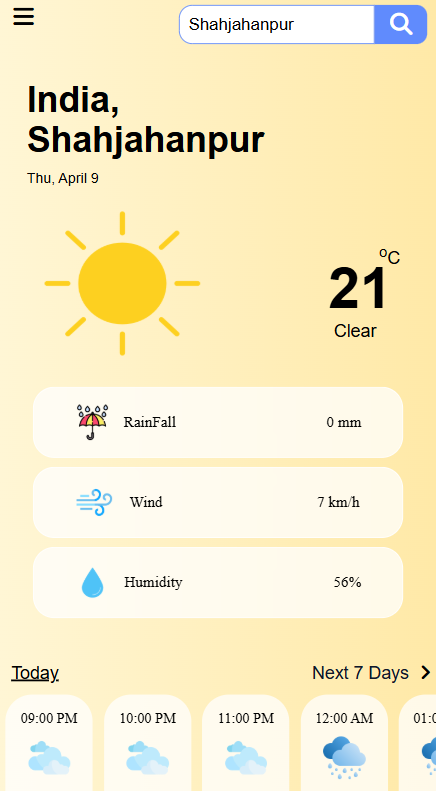
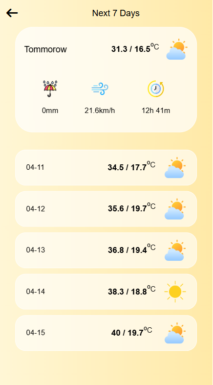

# Weather App 🌤️

A responsive weather application built using **HTML, CSS, and JavaScript** that fetches real-time weather data from the **Open-Meteo API**.  
It shows current weather details, hourly forecast, and next 7 days forecast with a clean and modern UI.

---

## ✨ Features

- Search weather by city name
- Current temperature, weather condition, humidity, wind speed, and visibility
- Hourly weather forecast
- Next 7 days forecast
- Dynamic weather icons
- Responsive design for mobile and desktop
- Clean UI with gradient background and card-based layout

---

## 🛠️ Tech Stack

- **HTML**
- **CSS**
- **JavaScript**

---

## 📸 Preview




---

## 📦 API Used

This project uses Open-Meteo, a free weather API.

* Current weather data
* Hourly forecast
* Daily forecast

---

## Live Demo
```

```
---

## 💡 What I Learned
* Working with APIs in JavaScript
* Using fetch() to get data from server
* Handling JSON response
* Creating responsive UI
* Displaying dynamic weather data based on API response

---

## 👨‍💻 Author
**Juhaib Husain**
